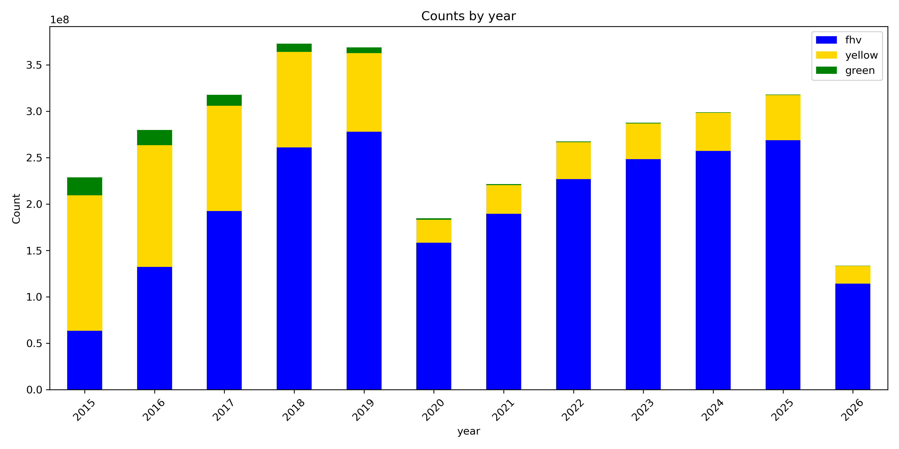

# Welcome to My Portfolio

Hello there, my name is Thanh Dat Hoang, born and raised in Vietnam. I did my master's and doctoral thesis on astrophysics at the University of Bonn and the Max Planck Institute for Radio Astronomy. 
I am now a data scientist specialising in big data processing and distributed computing.

## Projects

- [Taxi Trip Analysis](/2026/08/20/taxi-trip-analysis.html)
- [Data Pipeline Optimization]()

## About

[Learn more about me](/about.html)
