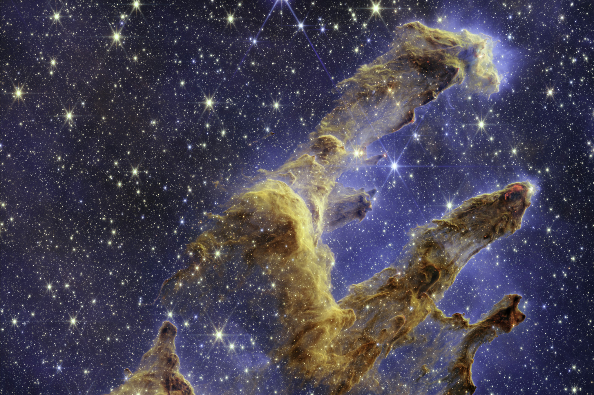

# Welcome to My Portfolio

Hello, my name is Thanh Dat Hoang, born and raised in Vietnam. I currently live in the beautiful city of Bonn in Germany, where I completed my master's and doctoral thesis in Astrophysics at the University of Bonn and the Max Planck Institute for Radio Astronomy. 
I am now a data scientist specialising in big data processing and distributed computing.

## Projects

- [Taxi Trip Analysis](/pages/nyc-taxi-trip-analysis.md)
  This project analyses over xxx taxi trips in the vicinity of New York City from 2015 until early 2026. It includes trips made with both traditional cabs (taxi) and modern app-based services (FHV aka for-hire vehicle) such as Uber and Lyft. more text will come ...

  

  
- [My Astrophysics world](/pages/Astro.md)
  This page showcases a summary of the scientific projects conducted during my PhD. The topics revolve around high-mass star formation. More specifically, my research aimed to study the properties of warm gas envelopes around the regions where high-mass stars are forming in our galaxy.

  

