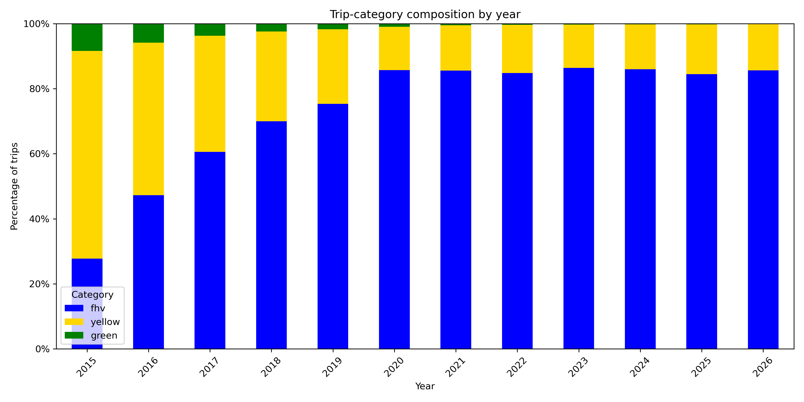

## Taxi Trip Analysis

Here's the hourly trip distribution across years:

Taxi service has been a very common means of travel in New York City. However, do user behaviour and the economic health of this business model remain the same today as it was a decade ago, especially after COVID-19 and the adoption of modern technology?

*Figure 1: Heatmap showing trip counts by hour (y-axis) and year (x-axis)*

